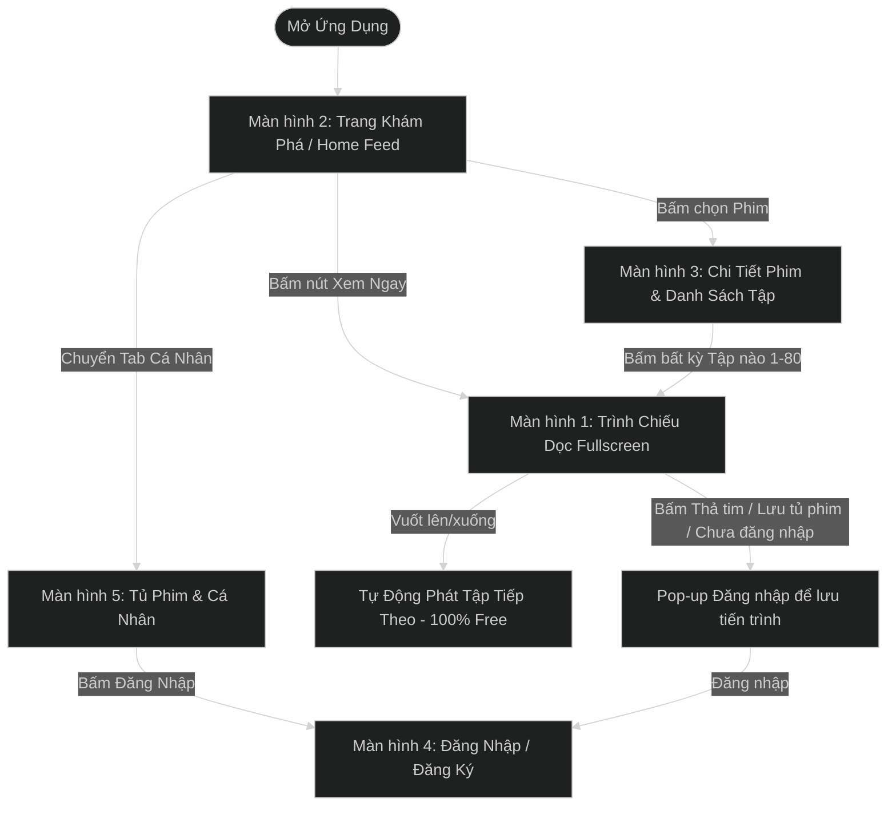

# TÀI LIỆU VẼ WIREFRAME & PHÂN TÍCH NGUYÊN MẪU ỨNG DỤNG PHIM NGẮN (SHORT DRAMA APP)
> **Benchmark đối chiếu:** App PineDrama - Short Dramas (TikTok Ltd.)  
> **Cập nhật:** Đã bỏ hoàn toàn Nạp Xu & Ổ Khóa - Mô hình Xem Phim Miễn Phí 100% (Free Access All Episodes)  
> **Thực hiện bởi:** BA Senior & Product Owner & Lead UI/UX Designer  
> **Định dạng lưu trữ:** UTF-8 Standard  
> **Thư mục:** `c:\Users\hoang\OneDrive\Desktop\Freelance\result_docs`

---

## 1. TỔNG QUAN DỰ ÁN & MÔ HÌNH TRUY CẬP (100% FREE ACCESS MODEL)

### 1.1 Khái niệm sản phẩm
Ứng dụng Phim Ngắn (Short Drama App) là nền tảng giải trí xem video dọc dạng ngắn (1 - 3 phút/tập), độ phân giải cao (HD/4K), phục vụ nhu cầu giải trí nhanh mọi lúc mọi nơi.

### 1.2 Mô hình Truy cập Phim Miễn Phí 100% (No Lock / All Episodes Free)
1. **Truy cập Miễn Phí Trọn Bộ (100% Free All Episodes):** Tất cả các tập phim từ Tập 1 đến Tập cuối (Tập 80+) đều mở Miễn Phí hoàn toàn. Người dùng không cần mua xu hay trả phí để xem các tập tiếp theo.
2. **Không có Ổ Khóa (No Lock Icons):** Giao diện loại bỏ toàn bộ icon Ổ khóa 🔐, loại bỏ các màn hìnhPaywall/Unlock.
3. **Mục đích Đăng nhập / Đăng ký:**
   - Người dùng có thể xem phim ngay lập tức mà không cần đăng nhập.
   - Đăng nhập (qua Google, Apple ID, TikTok, SĐT OTP) được khuyến khích để **lưu Tủ Phim**, **thả tim/bình luận** và **đồng bộ Lịch sử xem phim** giữa các thiết bị.

---

## 2. KIẾN TRÚC MÀN HÌNH & LUỒNG ĐIỀU HƯỚNG (APP NAVIGATION FLOW)



---

## 3. CHUYÊN ĐỀ CHI TIẾT WIREFRAME 5 MÀN HÌNH CỐT LÕI

Below is the detail breakdown for 5 main screens, including layout wireframes, component specification, and user interaction rules.

---

### MÀN HÌNH 1: TRÌNH CHỦ DỌC FULLSCREEN (IMMERSIVE VERTICAL VIDEO PLAYER)

#### 1.1 Khái niệm & Mục tiêu UX
Màn hình trải nghiệm cốt lõi của ứng dụng. Video hiển thị tràn màn hình tỷ lệ 9:16, hỗ trợ vuốt dọc để chuyển tập mượt mà, tự động phát tất cả các tập tiếp theo không giới hạn.

#### 1.2 Wireframe Layout (Cấu trúc giao diện)
```
+-------------------------------------------------------------+
|  [<] Phim: Vợ Cũ Lật Kèo (Tập 12/80)    [Sub: VI] [1.25x]  [*] |  <-- Top Bar (Overlay)
+-------------------------------------------------------------+
|                                                             |
|                                                             |
|                       [ VIDEO 9:16 ]                        |
|                     Full High Definition                     |
|                   (Vertical Drama Content)                  |
|                                                             |
|                                                     [ (A) ] |  <-- Avatar Diễn Viên / Follow
|                                                     [ (♥) ] |  <-- Heart / Like (12.4K)
|                                                     [ (💬) ]|  <-- Bình Luận (1.8K)
|                                                     [ (🔖) ]|  <-- Thêm Tủ Phim
|                                                     [ (↗) ] |  <-- Chia Sẻ (Share)
|                                                     [ (≡) ] |  <-- Drawer Tập Phim
|                                                             |
|                                                             |
+-------------------------------------------------------------+
| Subtitle: "Anh nghĩ tôi còn là cô gái dễ bị gạt năm xưa sao?"|  <-- Subtitle Overlay
+-------------------------------------------------------------+
| [Play/Pause]  ==========o====================  01:15 / 02:30 |  <-- Progress Seekbar
| [<<< Tập 11]            [TẬP TIẾP THEO >>>]  [▶ Xem Ngay]  |  <-- Quick Episode Nav Bar (Free)
+-------------------------------------------------------------+
| [Home]        [Khám Phá]        [Tủ Phim]        [Cá Nhân]  |  <-- Bottom Navigation
+-------------------------------------------------------------+
```

---

### MÀN HÌNH 2: TRANG KHÁM PHÁ & TRANG CHỦ (HOME & DISCOVER)

#### 2.1 Wireframe Layout
```
+-------------------------------------------------------------+
|  [LOGO APP]   [🔍 Tìm phim, diễn viên...]   [🔔] [🎁 FREE]|  <-- Top Bar & Header (FREE Chip)
+-------------------------------------------------------------+
|  [Cho Bạn]  [Hot Trend]  [Ngôn Tình]  [Chủ Tịch]  [Trả Thù] |  <-- Category Horizontal Tabs
+-------------------------------------------------------------+
| +---------------------------------------------------------+ |
| | [HERO BANNER SLIDER: PHIM HOT NHẤT TUẦN]                | |  <-- Big Featured Carousel Banner
| | Phim: "MẸ CHỒNG SIÊU CẤP & NÀNG DÂU TRIỆU ĐÔ"           | |
| | Trọn bộ 80 Tập • Xem Miễn Phí 100%                      | |
| | [▶ XEM NGAY TẬP 1]         [+ Thêm Tủ Phim]             | |
| +---------------------------------------------------------+ |
+-------------------------------------------------------------+
|  🔥 BẢNG XẾP HẠNG TOP 10 PHIM HOT                           |  <-- Top Chart Section
|  +------------+  +------------+  +------------+             |
|  | #1 POSTER  |  | #2 POSTER  |  | #3 POSTER  |             |
|  | 4.9★ - 1.2M|  | 4.8★ - 980K|  | 4.7★ - 850K|             |
|  | Tên Phim A |  | Tên Phim B |  | Tên Phim C |             |
|  +------------+  +------------+  +------------+             |
+-------------------------------------------------------------+
|  🎬 PHIM MỚI CẬP NHẬT (ALL FREE)                 [Xem tất cả]|  <-- Vertical Grid Section
|  +-----------------------+   +-----------------------+      |
|  | [POSTER 3:4 - FREE]   |   | [POSTER 3:4 - FREE]   |      |
|  | Cô Vợ Sát Thủ         |   | Tổng Tài Bá Đạo       |      |
|  | 80 Tập | 4.9★         |   | 65 Tập | 4.8★         |      |
|  +-----------------------+   +-----------------------+      |
+-------------------------------------------------------------+
| [🏠 Trang Chủ]  [🔍 Khám Phá]  [📚 Tủ Phim]  [👤 Cá Nhân]   | <-- Bottom Nav Bar
+-------------------------------------------------------------+
```

---

### MÀN HÌNH 3: TRANG CHI TIẾT PHIM (DRAMA DETAIL & EPISODE LIST)

#### 3.1 Wireframe Layout (100% Free Episode Grid - KHÔNG Ổ KHÓA)
```
+-------------------------------------------------------------+
|  [< Back]               [CHI TIẾT PHIM]            [↗ Share] |  <-- Top Bar
+-------------------------------------------------------------+
| +---------------------------------------------------------+ |
| | [BLUR BACKGROUND POSTER COVER]                          | |  <-- Header Backdrop
| |  +------------+  Tên Phim: VỢ CŨ LẬT KÈO                | |
| |  |  POSTER    |  Đánh giá: ⭐ 4.9/5.0 (14.2K lượt)       | |
| |  |   3:4      |  Thể loại: Ngôn Tình, Trả Thù, CEO     | |
| |  +------------+  Trạng thái: 80/80 Tập (Xem Miễn Phí 100%)| |
| +---------------------------------------------------------+ |
+-------------------------------------------------------------+
|  [ ▶ XEM TỪ TẬP 1 ]        [ + THÊM VÀO TỦ PHIM ]           |  <-- Main Action CTA Buttons
+-------------------------------------------------------------+
| 📖 TÓM TẮT NỘI DUNG:                                        |
| Sau khi bị gia đình chồng cũ hãm hại và tước đoạt tài sản,...|
+-------------------------------------------------------------+
| 🎬 DANH SÁCH TẬP (80 Tập)      [🎁 Tất cả các tập Miễn Phí]  |  <-- Episode Selector Header
| +---------+ +---------+ +---------+ +---------+ +---------+ |
| | Tập 1   | | Tập 2   | | Tập 3   | | Tập 4   | | Tập 5   | |
| | (Free)  | | (Free)  | | (Free)  | | (Free)  | | (Free)  | |
| +---------+ +---------+ +---------+ +---------+ +---------+ |
| | Tập 6   | | Tập 7   | | Tập 8   | | Tập 9   | | Tập 10  | |
| | (Free)  | | (Free)  | | (Free)  | | (Free)  | | (Free)  | |
| +---------+ +---------+ +---------+ +---------+ +---------+ |
+-------------------------------------------------------------+
```

---

### MÀN HÌNH 4: TRANG ĐĂNG NHẬP / ĐĂNG KÝ TÀI KHOẢN (AUTHENTICATION SCREEN)

#### 4.1 Khái niệm & Mục tiêu UX
Màn hình xác thực tài khoản phục vụ mục đích cá nhân hóa trải nghiệm (Lưu tủ phim, đồng bộ thiết bị, bình luận).

#### 4.2 Wireframe Layout
```
+-------------------------------------------------------------+
|  [X Đóng]                                       [Trợ Giúp ?]|  <-- Top Bar
+-------------------------------------------------------------+
|                                                             |
|                 🔥 PINE DRAMA SHORT APP                     |
|           Đăng nhập để lưu tủ phim & đồng bộ lịch sử        |
|                                                             |
|   +-----------------------------------------------------+   |
|   |  [ TAB: ĐĂNG NHẬP ]          [ TAB: ĐĂNG KÝ ]       |   |  <-- Switch Tab
|   +-----------------------------------------------------+   |
|                                                             |
|   📱 SỐ ĐIỆN THOẠI / EMAIL:                                 |
|   +-----------------------------------------------------+   |
|   | 🇻🇳 +84 | Nhập số điện thoại hoặc email...          |   |  <-- Input Field
|   +-----------------------------------------------------+   |
|                                                             |
|   🔑 MẬT KHẨU / MÃ OTP:                                      |
|   +-----------------------------------------------------+   |
|   | Nhập mật khẩu...                     [Gửi OTP SMS]  |   |  <-- Password/OTP Field
|   +-----------------------------------------------------+   |
|                                                             |
|   [Quên mật khẩu?]                             [Đăng nhập OTP]
|                                                             |
|   +-----------------------------------------------------+   |
|   | ⚡ ĐĂNG NHẬP TÀI KHOẢN                               |   |  <-- Primary CTA Button
|   +-----------------------------------------------------+   |
|                                                             |
|   ------------ Hoặc đăng nhập nhanh bằng ------------       |
|                                                             |
|   +-----------------------------------------------------+   |
|   | [G] Đăng nhập bằng Google                           |   |  <-- Social Login 1
|   +-----------------------------------------------------+   |
|   | [] Đăng nhập bằng Apple ID                         |   |  <-- Social Login 2
|   +-----------------------------------------------------+   |
|   | [🎵] Đăng nhập bằng TikTok                           |   |  <-- Social Login 3
|   +-----------------------------------------------------+   |
+-------------------------------------------------------------+
```

---

### MÀN HÌNH 5: TRANG TỦ PHIM & HỒ SƠ CÁ NHÂN (MY LIBRARY & PROFILE)

#### 5.1 Wireframe Layout
```
+-------------------------------------------------------------+
| [⚙️ Cài Đặt]                CÁ NHÂN                  [🔔 2] |  <-- Top Bar
+-------------------------------------------------------------+
|  +-------------------------------------------------------+  |
|  |  [AVATAR]  HOÀNG NGUYỄN (ID: 889210)                    |  |
|  |            [🎁 TÀI KHOẢN MIỄN PHÍ]                      |  |
|  |            SĐT: 098****888 • Email: hoang@gmail.com     |  |
|  +-------------------------------------------------------+  |
+-------------------------------------------------------------+
|  [▶ Đang Xem (4)]        [🔖 Tủ Phim (12)]       [❤️ Đã Thả Tim]|  <-- Horizontal Tabs
+-------------------------------------------------------------+
|  ⏯️ TIẾP TỤC XEM (CONTINUE WATCHING):                       |
|  +-------------------------------------------------------+  |
|  | [POSTER]  Vợ Cũ Lật Kèo                               |  |
|  |           Đã xem: Tập 12/80 (Tiến trình: 65%)         |  |
|  |           [ ▶ XEM TIẾP TẬP 13 ]                       |  |
|  +-------------------------------------------------------+  |
+-------------------------------------------------------------+
|  ⚙️ TIỆN ÍCH & CÀI ĐẶT:                                     |
|  - 🌐 Ngôn ngữ ứng dụng / Phụ đề mặc định     [ Tiếng Việt >]|
|  - 🔒 Quản lý tài khoản & Bảo mật                            [>]|
|  - 💬 Trung tâm hỗ trợ & Góp ý ý kiến                      [>]|
|  - 🚪 Đăng xuất tài khoản                                  [>]|
+-------------------------------------------------------------+
| [🏠 Trang Chủ]  [🔍 Khám Phá]  [📚 Tủ Phim]  [👤 Cá Nhân]   | <-- Bottom Nav Bar
+-------------------------------------------------------------+
```

---

## 4. TỔNG KẾT VÀ BÀN GIAO REPO
Tài liệu này cung cấp bộ wireframe cập nhật hoàn chỉnh theo mô hình **100% Free - Không khóa tập**, sẵn sàng để chuyển giao cho bộ phận Mobile App và Backend Team triển khai.

- **File Wireframe Markdown:** `c:\Users\hoang\OneDrive\Desktop\Freelance\result_docs\Wireframe_App_Phim_Ngan_PineDrama.md`
- **File Prototype Tương Tác (HTML/CSS):** `c:\Users\hoang\OneDrive\Desktop\Freelance\result_docs\wireframe_interactive.html`
