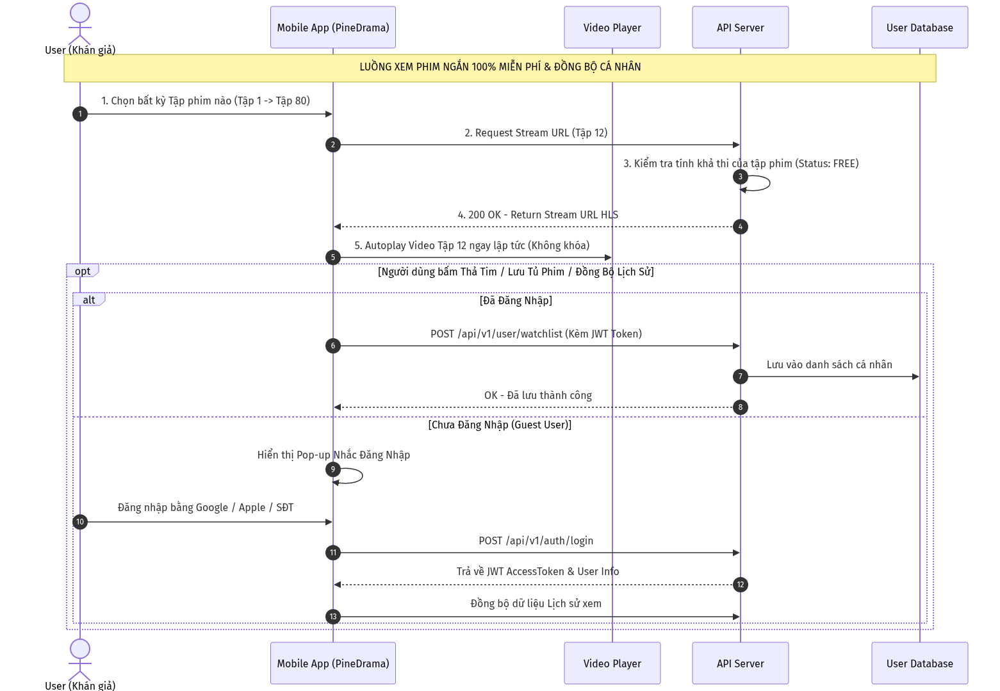
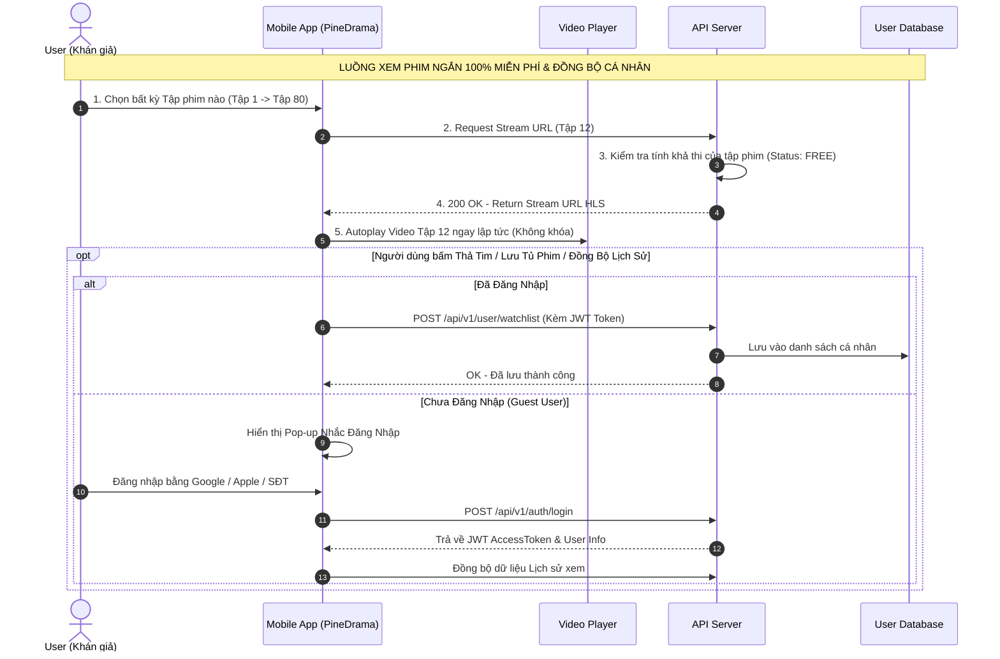

# Sơ đồ Sequence Diagram: Luồng Xem Phim Miễn Phí 100% & Đồng Bộ Tài Khoản (Free Playback Flow)

Dưới đây là sơ đồ trình tự tương tác hệ thống khi người dùng xem phim ngắn trọn bộ 100% Miễn phí và luồng đăng nhập để đồng bộ dữ liệu cá nhân.

## Mã nguồn Mermaid (Dark Theme)

## Bảng giải thích chi tiết luồng
1. **Phim mở 100% Free:** Mọi tập phim từ Tập 1 đến tập 80+ đều gọi API phát HLS video ngay lập tức không bị rào cản phân quyền hay trả phí.
2. **Trải nghiệm phát liền mạch:** Người dùng vuốt lên/xuống chuyển tập mượt mà không bị ngắt quãng bởi màn hình khóa.
3. **Đồng bộ đám mây:** Khi đăng nhập, tiến trình lịch sử xem phim và danh sách tủ phim sẽ được lưu an toàn trên Database.
